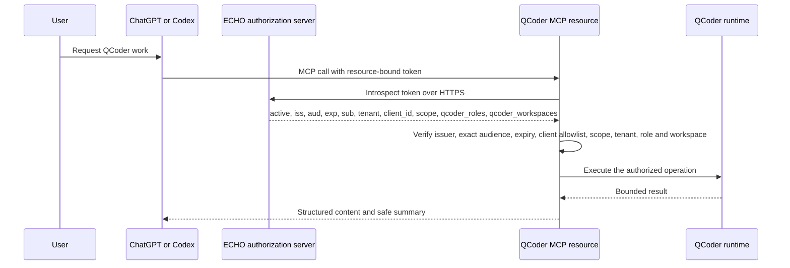

# Authentication and authorization

HTTP deployments are protected OAuth 2.1 resource servers. The canonical resource is `https://mcp.echo-op.com/oauth-mcp-qcoder-v1`; it is not live yet, so production OAuth and ChatGPT-host verification remain blocked by that external deployment dependency.

## Required flow

The authorization server must publish standard authorization/OIDC metadata, support authorization code with PKCE `S256`, preserve the `resource` parameter, bind the token audience to the QCoder resource, and expose protected-resource metadata. The MCP edge returns `WWW-Authenticate`; protected tool failures also return `_meta["mcp/www_authenticate"]`.

## Enforced claims

- `active: true`
- expected issuer and exact resource audience
- unexpired `exp`
- nonempty `sub`, `tenant`, and allowlisted `client_id`
- space-delimited least-privilege scope
- `qcoder_roles`: array of permitted fleet roles or `*`
- `qcoder_workspaces`: array of registered workspace keys or `*`

Scopes are `qcoder.sessions.read`, `qcoder.sessions.start`, `qcoder.sessions.write`, and `qcoder.sessions.stop`. The server performs authorization; the model cannot grant itself access by selecting another resource ID.

Local stdio is a separate trust boundary and is enabled only by `.mcp.json` setting `QCODER_TRUSTED_STDIO=1`. `QCODER_LOCAL_DEV_AUTH=1` is rejected outside loopback/development configuration and must never be present in production.

Tokens and introspection credentials are never written to source, transcripts, widget state, tool results, or logs. Revocation takes effect on the next introspection; bounded positive caching may be added only if its TTL never exceeds token expiry.
